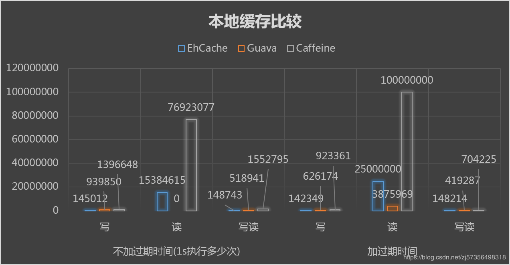

# Java 单机内存缓存框架总结与选型

本文**仅**针对 **Java** + **单机** + **内存** 缓存来讨论学习。其它情况下，复杂得很。。。

## 缓存

缓存，顾名思义就是将一个东西存着，在要使用的时候可以直接拿来用，以提升效率。本质上具有这几个特点：

1. 愿意用内存空间换时间
2. 读 >> 写
3. 数据总量 < 内存总量

存储结构本质上是一个类似 `Map` 的东西。只是由于使用场景，使其又要与 Map 有些许不同（简单情况下，可以直接用 `Map` 来理解）。

因此，使用 `ConcurrentHashMap` 自然而然的就可以直接实现一个缓存的功能了。

当然，为了使其是一个好用的缓存，`ConcurrentHashMap` 的功能自然就不够看了，这也是本文下面内容需要一起讨论的内容。

## 缓存的功能

我总结了一下，必须的 `put` 和 `get` 缓存项就不用多说，一个功能完备的缓存**还**应当具备如下的功能：

1. 加载（如果有合理的默认方法来加载时首选的，因此可以更容易地推断所有缓存内存的一致性）
2. 失效（基于各种策略的自动缓存失效）
3. 统计（命中率、加载时间、缓存失效总数等）
4. 通知（移除缓存项时的监听器）

以上的这些功能自己去实现当然也是可以的，当时难免费时费力。所以就引出了下面对缓存框架的总结与选型过程。

这里，我选取了 `javax.cache`、`Ehcache`、`Guava Cache`、`Caffeine` 这 4 个最常见的缓存框架进行简单的介绍、分析和比较，其余的框架五花八门，也没有大厂背书，就先不讨论了。

## javax.cache

`javax.cache`（[Star: 88](https://github.com/jsr107/RI)）是 JSR-107 提出的 `Java` 关于 `cache` 方面 API 的规范，不过大约 2015 年多才通过，太迟推出了，实际上，市面上的 `cache` 框架也没理这个规范，JDK 标准库也默认没有引入这部分 API。

这个规范没有官方的实现，制定者们自己实现了这个规范的 RI，但是明确表示了仅供学习，不建议商业用途。

## Ehcache

`Ehcache`（[Star: 1.5k](https://github.com/ehcache/ehcache3)）是一个纯 Java 的进程内缓存框架。主要以前会流行是因为它时 Hibernate 中默认的 `CacheProvider`。

## Guava Cache

`Guava Cache`（[Star: 36.8k](https://github.com/google/guava)）是来自 Google 的 Java 核心功能类库。其中包含了集合操作、并发、IO、缓存等许多功能，被许多公司广泛使用。`Guava Cache` 是使用其中关于缓存功能的实现。

## Caffeine

`Caffeine`（[Star: 7.4k](https://github.com/ben-manes/caffeine)）是基于 JDK 1.8 基础下，为了实现高效的缓存，将 `Guava Cache` 中关于缓存功能的部分抽离出来重写、优化。本质上与 `Guava Cache` 高度的相似（接口 API 几乎都是完全一致的），仅在内部实现时进行了优化，达到了效率提升了非常多的目的。现在 `Spring` 已经使用 `Caffeine` 替代 `Guava Cache` 作为 `Spring Cache` 缓存的默认实现了。

## 选型

### 一、功能对比

接下来会针对上文中提到的 4 个缓存的功能对框架进行比较（部分框架没有深入研究过最新版本，不保证完全准确）：

#### 1. 加载

| 框架 / 功能 | 同步手动加载 | 同步自动加载 | 异步加载 |
| :---------: | :------: | :------: | :------: |
| javax.cache | ✔ | × | × |
|   Ehcache   | ✔ | ✔ | × |
| Guava Cache | ✔ | ✔ | ✔ |
|  Caffeine   | ✔ | ✔ | ✔ |

#### 2. 失效

| 框架 / 功能 | 特定值 |  量  | 时间 | 引用 |   淘汰算法   | 自定义策略 |
| :---------: | :----: | :--: | :--: | :--: | :----------: | :--------: |
| javax.cache |   ✔    |  ×   |  ×   |  ×   |      *       |     ✔      |
|   Ehcache   |   ✔    |  ✔   |  ✔   |  ×   | FIFO\LRU\LFU |     *      |
| Guava Cache |   ✔    |  ✔   |  ✔   |  ✔   |     LRU      |     *      |
|  Caffeine   |   ✔    |  ✔   |  ✔   |  ✔   |  W-TinyLFU   |     ✔      |

#### 3. 统计

| 框架 / 功能 | 命中数 | 未命中数 | 加载成功数 | 加载失败数 | 加载总用时 | 被回收总数（不包括显示回收） | 回收权重总和 |
| :---------: | :----: | :------: | :--------: | :--------: | :--------: | :--------------------------: | :----------: |
| javax.cache |   ×    |    ×     |     ×      |     ×      |     ×      |              ×               |      ×       |
|   Ehcache   |   ×    |    ×     |     ×      |     ×      |     ×      |              ×               |      ×       |
| Guava Cache |   ✔    |    ✔     |     ✔      |     ✔      |     ✔      |              ✔               |      ×       |
|  Caffeine   |   ✔    |    ✔     |     ✔      |     ✔      |     ✔      |              ✔               |      ✔       |

#### 4. 通知

| 框架 / 功能 | 移除缓存项时通知 |
| :---------: | :--------------: |
| javax.cache |        ×         |
|   Ehcache   |        ×         |
| Guava Cache |        ✔         |
|  Caffeine   |        ✔         |

### 二、性能对比

图片来源：网络

结论：几乎任何场景下，`caffeine` 都是目前最**快**的缓存框架。为什么呢？

因为 `Caffeine` 默认使用了结合 LRU 和 LFU 的 W-TinyLFU 缓存淘汰算法。具体算法解析可以参考这篇[网文](https://www.cnblogs.com/liujinhua306/p/9808500.html)。

### 二、总结

#### javax.cache

* 优点：没有什么优点，只能强行说是符合 JSR 规范。
* 缺点：没有官方实现，仅有作者实现，且仅供学习不推荐商业用途。

#### Ehcache

* 优点：很古老的缓存框架，现在还能在 `Hibernate`、`Shiro` 等框架中见到身影。
* 缺点：用起来麻烦，需要 xml 配置。不活跃了。

#### Guava Cache

* 优点：Google 大厂背书。
* 缺点：使用这个需要引入整个 Guava 库，依赖复杂。性能一般。

#### Caffeine

* 优点：Spring 背书、功能强大、性能最好，依赖少、社区活跃。
* 缺点：目前没有什么缺点。Base JDK1.8。

---

综上，目前来看 `Caffeine` 貌似是最佳的选择。:smiley: